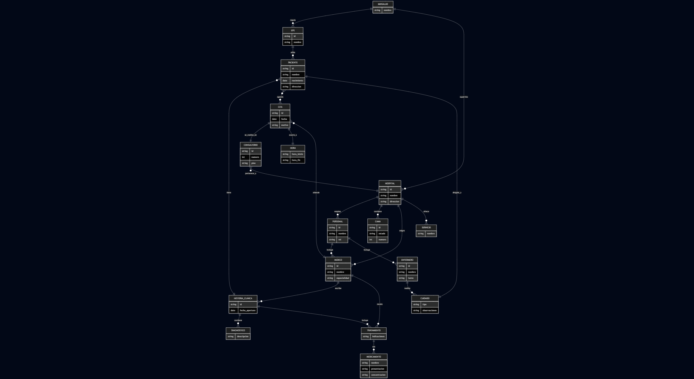

<div align="center">

# Sistema Hospitalario 

&nbsp;  
&nbsp;  
&nbsp;  
&nbsp;  
&nbsp;  

**Vladmir Diaz Contreras**  
**Santiago Andres Quiñonez Sosa**

&nbsp;  
&nbsp;  
 
**S1**  
&nbsp;  
&nbsp;  
&nbsp;  

**PEDRO FELIPE GÓMEZ BONILLA**  

&nbsp;  
&nbsp;  
&nbsp;  

**CAMPUSLANDS**  
**Cajasan**  
**RUTA NODEJS**  
**BUCARAMANGA**  
**CAJASAN**
**2025**
<br>
</div>
<br>

#

<br>
<br>

## Tabla de Contenidos

- [Introducción](#introducción)
- [Caso de Estudio](#caso-de-estudio)
- [Planificación](#planificación)
- [Construcción del Modelo Conceptual](#construcción-del-modelo-conceptual)
  - [Descripción](#descripción)
  - [Gráfica](#gráfica)
  - [Descripción Técnica](#descripción-técnica)
- [Construcción del Modelo Lógico](#construcción-del-modelo-lógico)
  - [Descripción](#descripción-1)
  - [Gráfica](#gráfica-1)
  - [Descripción Técnica](#descripción-técnica-1)
- [Normalización del Modelo Lógico](#normalización-del-modelo-lógico)
  - [Primera Forma Normal (1FN)](#primera-forma-normal-1fn)
    - [Descripción](#descripción-2)
    - [Gráfica](#gráfica-2)
    - [Descripción Técnica](#descripción-técnica-2)
  - [Segunda Forma Normal (2FN)](#segunda-forma-normal-2fn)
    - [Descripción](#descripción-3)
    - [Gráfica](#gráfica-3)
    - [Descripción Técnica](#descripción-técnica-3)
  - [Tercera Forma Normal (3FN)](#tercera-forma-normal-3fn)
    - [Descripción](#descripción-4)
    - [Gráfica](#gráfica-4)
    - [Descripción Técnica](#descripción-técnica-4)
- [Construcción del Modelo Físico](#construcción-del-modelo-físico)
  - [Descripción](#descripción-5)
  - [Código](#código)
  - [Descripción Técnica](#descripción-técnica-5)
- [Diagrama E-R](#diagrama-e-r)
  - [Descripción](#descripción-6)
  - [Gráfica](#gráfica-5)
  - [Descripción Técnica](#descripción-técnica-6)
- [Tablas](#tablas)
  - [Descripción](#descripción-7)
  - [Gráfica](#gráfica-6)
  - [Descripción Técnica](#descripción-técnica-7)
- [Relaciones entre Tablas](#relaciones-entre-tablas)
  - [Descripción](#descripción-8)
  - [Gráfica](#gráfica-7)
  - [Descripción Técnica](#descripción-técnica-8)
- [Inserción de Datos](#inserción-de-datos)
  - [Descripción](#descripción-9)
  - [Gráfica](#gráfica-8)
  - [Descripción Técnica](#descripción-técnica-9)
- [Referencias](#referencias)
<h2 id="construcción-del-modelo-conceptual">Construcción del Modelo Conceptual</h2>

<h3 id="descripción">Descripción</h3>

<h4>Entidades y atributos principales:</h4>

<ol>
  <li><strong>Hospital</strong>
    <ul>
      <li><code>_id</code> (UUID)</li>
      <li><code>nombre</code></li>
      <li><code>dirección</code></li>
      <li><code>teléfono</code></li>
      <li><code>áreas</code> (lista de cadenas de texto)</li>
    </ul>
  </li>

  <li><strong>Médico</strong>
    <ul>
      <li><code>_id</code> (UUID)</li>
      <li><code>nombre</code></li>
      <li><code>hospital_id</code> (referencia a Hospital)</li>
      <li><code>área</code></li>
      <li><code>especialidad</code></li>
      <li><code>registro_médico</code></li>
      <li><code>obligaciones</code> (lista de cadenas de texto)</li>
    </ul>
    <p><strong>Relaciones:</strong> Atiende pacientes (vía historia_clínica)</p>
  </li>

  <li><strong>Administrativo</strong>
    <ul>
      <li><code>_id</code> (UUID)</li>
      <li><code>nombre</code></li>
      <li><code>cargo</code></li>
      <li><code>hospital_id</code> (referencia a Hospital)</li>
      <li><code>obligaciones</code></li>
    </ul>
  </li>

  <li><strong>Paciente</strong>
    <ul>
      <li><code>_id</code> (UUID)</li>
      <li><code>nombre</code></li>
      <li><code>tipo_documento</code></li>
      <li><code>numero_documento</code></li>
      <li><code>fecha_nacimiento</code></li>
      <li><code>dirección</code></li>
      <li><code>teléfono</code></li>
      <li><code>eps_id</code> (UUID)</li>
      <li><code>obligaciones</code></li>
      <li><code>historia_clínica</code> (lista de subdocumentos)</li>
    </ul>
  </li>

  <li><strong>Historia Clínica</strong> (subdocumento de Paciente)
    <ul>
      <li><code>fecha</code></li>
      <li><code>motivo</code></li>
      <li><code>diagnóstico</code></li>
      <li><code>medico_id</code> (referencia a Médico)</li>
      <li><code>tratamiento</code></li>
    </ul>
  </li>

  <li><strong>EPS</strong>
    <ul>
      <li><code>_id</code> (UUID)</li>
      <li><code>nombre</code> (String)</li>
      <li><code>responsabilidades</code></li>
      <li><code>Director_EPS</code> (subdocumento)</li>
    </ul>
  </li>

  <li><strong>Director_EPS</strong>
    <ul>
      <li><code>_id</code> (UUID)</li>
      <li><code>nombre</code> (String)</li>
      <li><code>responsabilidades</code></li>
    </ul>
  </li>
</ol>

<h3 id="gráfica">Gráfica</h3>

<div align="center">
  
  <br><br>
  <a href="https://drive.google.com/file/d/1TrpyUwY_rDEoA1gYqghtMEs9JYpaQpoM/view?usp=sharing" target="_blank">🔗 Ver en Draw.io</a>
</div>

<h3 id="descripción-técnica">Descripción Técnica</h3>

<p>
  El modelo conceptual del sistema hospitalario se define a través de entidades clave y sus relaciones, sin tener en cuenta el almacenamiento físico.
  Las principales entidades son: <strong>Hospital</strong>, <strong>Médico</strong>, <strong>Administrativo</strong>, <strong>Paciente</strong>,
  <strong>Historia Clínica</strong>, <strong>EPS</strong> y <strong>Director de EPS</strong>.
</p>

<p>
  Cada hospital tiene atributos como <code>_id</code>, nombre, dirección, teléfono y lista de áreas.
  Los hospitales se relacionan con médicos y personal administrativo mediante el campo <code>hospital_id</code>.
</p>

<p>
  Los médicos se caracterizan por su identificación única, nombre, especialidad, área de trabajo, obligaciones,
  y están conectados a los pacientes por medio del subdocumento historia clínica.
</p>

<p>
  El personal administrativo posee nombre, cargo, hospital asociado y una lista de obligaciones.
</p>

<p>
  Los pacientes incluyen datos personales, su EPS asociada (<code>eps_id</code>), obligaciones,
  y una colección de historias clínicas que representan la atención médica recibida,
  con información como fecha, motivo, diagnóstico, médico tratante y tratamiento.
</p>

<p>
  La entidad <strong>EPS</strong> contiene información propia y un subdocumento llamado <strong>Director_EPS</strong>,
  el cual guarda datos del director junto con sus responsabilidades.
  Las EPS pueden estar asociadas a múltiples pacientes.
</p>
<p>
  Este modelo permite visualizar un sistema hospitalario completo, distribuido en diferentes capas administrativas y clínicas,
  con relaciones estructuradas entre los actores del sistema de salud.
</p>
<h2 id="construcción-del-modelo-lógico">Construcción del Modelo Lógico</h2>

<h3 id="descripción-1">Descripción</h3>

<p>
  El modelo lógico de esta base de datos en MongoDB representa una estructura orientada a documentos, con relaciones referenciales suaves (no estrictas) mediante UUIDs.
  El diseño se organiza en las siguientes entidades:
</p>

<ul>
  <li>
    <strong>Hospitales:</strong> Es una entidad principal que contiene atributos como <code>_id</code> (UUID), <code>nombre</code>, <code>dirección</code>, <code>teléfono</code>,
    y un array de <code>áreas</code> que representa los distintos servicios ofrecidos.
    Cada hospital puede estar relacionado con múltiples médicos y administrativos.
  </li>

  <li>
    <strong>Médicos:</strong> Se relacionan con hospitales a través del campo <code>hospitalId</code>,
    actuando como una clave foránea lógica hacia <code>hospitales._id</code>.
    Incluyen atributos como <code>nombre</code>, <code>área</code>, <code>especialidad</code>, <code>registro_medico</code> y un array de <code>obligaciones</code>.
  </li>

  <li>
    <strong>Administrativos:</strong> También se relacionan con hospitales mediante <code>hospitalId</code>
    y almacenan datos como <code>nombre</code>, <code>cargo</code> y sus <code>obligaciones</code>, similares a los médicos.
  </li>

  <li>
    <strong>Pacientes:</strong> Esta entidad incluye datos de identificación personal, <code>epsId</code> (referencia lógica a EPS),
    y un array embebido <code>historia_clinica</code>.
    Cada entrada de la historia clínica incluye los campos: <code>fecha</code>, <code>motivo</code>, <code>diagnóstico</code>, <code>tratamiento</code> y <code>medicoId</code> (como referencia lógica).
  </li>
</ul>

<p>
  En conjunto, el modelo lógico usa referencias por UUID para establecer relaciones entre documentos, evita <em>joins</em> complejos al embedir información relevante (como la historia clínica),
  y favorece la consulta eficiente en contextos médicos, manteniendo una estructura flexible y escalable.
</p>

<h3 id="gráfica-1">Gráfica</h3>

<div align="center">
  
  <br><br>
  <a href="https://mermaid.live/edit#pako:eNqlVttuozAQ_RXk56RK7w1viLBbpAQqSPdhFSlyYUKsBRsZU22b5N_XJtwKpJvd8hTbx2cuZ8aTHQpYCEhHwGcERxwnK6rJb2E7vjF_nmn7_XjMdpr15Gu6xiHKYzyMeHT9J3tpzCUsy1PgrySTyCNW3S5hT4ZpW87SkjC8ITEp2ertAxuP93vt0faXrmcba3NuO7ZpSLggQGEALUlNaVgRRkDD2mjtUGXZ8nzXKRyEJI0BD8NMY6G4AkZbBrughTWzTVeZzEhETzD5lvfDNm0FYxsOAVSe1Z502QgN4vwNhlGW883yFpb3AVhqcSSoIiizofwPYQgxkF3IAk5eBtFLz1gaC5Vwt6iBAESjbO1UZfzZnhmzIxDH5L1GFl4pkFTXdB3_ea5cUMAM1iV2DQPgR9dTDrIg5xzWDV-LoyqapgRlAQqpXtC60Au69HhmG98d118eJejofuLOx5R01GgfthU2FiU-bzqjSlcZa6s7QsJJRELWBNAm2R231JcJTmikUZa8cOhtpxwyoAIHhNHeoQw2kIe8dXqoi7RypW-KhH-1HmIBGpW8iUymYD28jA6CAatl5f2XzXIbshQCIuspxGGHvanWrxgQOaesw1wU7OekRUo2EGxxD5YwQV57lK0C_5yZUKHRPAHez3NKsi5v3SVfycEp_dRL_8-8jfrVTNmdh--157kKrLF6IHKOO4Ttt6DPFRaPZDoQdrvlB3ygIQmKHoOsK3LZ__1LgqR9OdlLJifrMFU9L76iK2dxh7aeYmdqUszPs1yATOCQnS7jVsV6Q5RbxvGaUCKzMXy2IZVOaIQiTkKkC57DCEkbCVZLVLCukNhCAiuky58h5r9WaEXVnRTTn4wl1TXO8miL9A2OM7nKU1VP5b-mGqJGLjdZTgXSr-4KCqTv0G-5epheXF9eTic3l5PpZDpCb2rv4ub6_ubh9vp2cjW9u7q7P4zQe2FycvFwf3v4A41k2uo" target="_blank">🔗 Ver en Draw.io</a>
</div>


<h3 id="descripción-técnica-1">Descripción Técnica</h3>

<p>
  El modelo lógico general del sistema hospitalario define múltiples colecciones interrelacionadas en una base de datos MongoDB,
  representadas por entidades clave.
</p>

<p>
  La colección <strong>hospitales</strong> contiene identificadores únicos (<code>_id</code>), junto con datos como <code>nombre</code>, <code>direccion</code>, <code>telefono</code>
  y una lista de <code>areas</code> que representan las unidades médicas disponibles.
</p>

<p>
  La colección <strong>medicos</strong> incluye su propio <code>_id</code>, <code>nombre</code>, <code>hospitalId</code> (como referencia lógica al hospital donde labora),
  <code>area</code>, <code>especialidad</code>, <code>registro_medico</code> y un arreglo de <code>obligaciones</code>.
</p>

<p>
  De forma similar, la colección <strong>administrativos</strong> almacena funcionarios vinculados a un hospital mediante el campo <code>hospitalId</code>,
  con sus respectivos <code>cargos</code> y <code>obligaciones</code>.
</p>

<p>
  Por otro lado, la colección <strong>pacientes</strong> incluye campos como <code>_id</code>, <code>nombre</code>, <code>tipo_documento</code>,
  <code>numero_documento</code>, <code>fecha_nacimiento</code>, <code>direccion</code>, <code>telefono</code>,
  el identificador de su EPS (<code>epsId</code>), un arreglo de <code>obligaciones</code>,
  y una subestructura llamada <code>historia_clinica</code>, que es una lista de objetos con los campos <code>fecha</code>, <code>motivo</code>,
  <code>diagnostico</code>, <code>medicoId</code> (como referencia al médico tratante) y <code>tratamiento</code>.
</p>

<p>
  Finalmente, la colección <strong>eps</strong> está compuesta por <code>_id</code>, <code>nombre</code>,
  una lista de <code>responsabilidades</code> y un subdocumento embebido <strong>Director_EPS</strong>,
  que a su vez incluye un <code>_id</code>, <code>nombre</code>, <code>tipo_de_usuario</code> y sus <code>obligaciones</code>.
</p>

<p>
  Las relaciones entre entidades se manejan mediante referencias UUID, sin cambiar la estructura original del JSON,
  permitiendo una integración lógica limpia y flexible entre hospitales, personal, pacientes y entes externos como las EPS.
</p>


## Inserción Completa de Colecciones para el Sistema Hospitalario

## Colección: MINSALUD

```js
db.MINSALUD.insertMany([
  {"nombre": "Ministerio de Salud de Colombia"}
]);
```

## Colección: EPS

```js
db.EPS.insertMany([
  {"id": "eps01", "nombre": "Salud Total"},
  {"id": "eps02", "nombre": "Nueva EPS"},
  {"id": "eps03", "nombre": "Coomeva"},
  {"id": "eps04", "nombre": "Sura"}
]);
```

## Colección: HOSPITAL

```js
db.HOSPITAL.insertMany([
  {"id": "hos01", "nombre": "Hospital Central", "direccion": "Calle 100 #25-30"},
  {"id": "hos02", "nombre": "Clínica Norte", "direccion": "Carrera 45 #11-50"},
  {"id": "hos03", "nombre": "Hospital del Sur", "direccion": "Carrera 12 #65-12"},
  {"id": "hos04", "nombre": "Centro Médico San Juan", "direccion": "Calle 45 #30-20"}
]);
```

## Colección: PACIENTE

```js
db.PACIENTE.insertMany([
  {"id": "eb7fff59", "nombre": "Juan Ruiz", "nacimiento": "1998-01-13", "direccion": "Calle 8 #50-94"},
  {"id": "45000976", "nombre": "Pedro Ruiz", "nacimiento": "1959-10-13", "direccion": "Calle 98 #75-69"},
  {"id": "d11d2f31", "nombre": "María Fernández", "nacimiento": "1955-07-20", "direccion": "Calle 98 #36-44"},
  {"id": "534dc742", "nombre": "Laura Ramírez", "nacimiento": "1988-08-24", "direccion": "Calle 80 #38-85"},
  {"id": "d5a9645c", "nombre": "Andrés Suárez", "nacimiento": "1999-04-26", "direccion": "Calle 56 #10-89"},
  {"id": "449e8b46", "nombre": "Laura Fernández", "nacimiento": "1963-03-16", "direccion": "Calle 10 #95-10"},
  {"id": "14f8987c", "nombre": "Pedro Ramírez", "nacimiento": "2012-12-17", "direccion": "Calle 77 #55-37"},
  {"id": "d0463d78", "nombre": "Juan Ramírez", "nacimiento": "2008-04-08", "direccion": "Calle 35 #45-21"},
  {"id": "edcdb0dc", "nombre": "Luisa Fernández", "nacimiento": "1998-12-31", "direccion": "Calle 27 #98-89"},
  {"id": "76a62a3c", "nombre": "Laura Fernández", "nacimiento": "1950-03-25", "direccion": "Calle 14 #67-84"},
  {"id": "230d3679", "nombre": "María Ruiz", "nacimiento": "2006-04-16", "direccion": "Calle 11 #38-16"},
  {"id": "d58f3b09", "nombre": "Pedro Fernández", "nacimiento": "1966-12-23", "direccion": "Calle 50 #59-35"},
  {"id": "d0162bb8", "nombre": "Pedro Suárez", "nacimiento": "1958-05-29", "direccion": "Calle 10 #67-74"},
  {"id": "55a5f324", "nombre": "María Ramírez", "nacimiento": "1974-09-11", "direccion": "Calle 67 #73-54"},
  {"id": "13b2f810", "nombre": "María Suárez", "nacimiento": "1966-10-02", "direccion": "Calle 16 #91-92"},
  {"id": "123fd4ca", "nombre": "Andrés Suárez", "nacimiento": "1950-12-04", "direccion": "Calle 3 #39-36"},
  {"id": "6520abd5", "nombre": "Luisa Fernández", "nacimiento": "1951-06-14", "direccion": "Calle 3 #20-92"},
  {"id": "5962f650", "nombre": "María Suárez", "nacimiento": "1959-07-21", "direccion": "Calle 100 #88-2"},
  {"id": "5a8dd9f5", "nombre": "Andrés Ramírez", "nacimiento": "1961-05-18", "direccion": "Calle 50 #33-89"},
  {"id": "c0df74d0", "nombre": "María Fernández", "nacimiento": "1991-09-04", "direccion": "Calle 8 #33-28"},
  {"id": "efe59c86", "nombre": "Luisa Fernández", "nacimiento": "1978-10-10", "direccion": "Calle 1 #55-52"},
  {"id": "5de35b9b", "nombre": "María Ramírez", "nacimiento": "2002-01-13", "direccion": "Calle 86 #84-1"},
  {"id": "1745c048", "nombre": "Luisa Fernández", "nacimiento": "1952-04-07", "direccion": "Calle 100 #65-97"},
  {"id": "0abe8e94", "nombre": "María Ruiz", "nacimiento": "1951-07-04", "direccion": "Calle 78 #68-91"},
  {"id": "bffe29ff", "nombre": "Juan Ruiz", "nacimiento": "1996-08-04", "direccion": "Calle 47 #33-84"},
  {"id": "02a97b57", "nombre": "Juan Suárez", "nacimiento": "1987-03-05", "direccion": "Calle 57 #27-40"},
  {"id": "86150b60", "nombre": "Andrés Ramírez", "nacimiento": "2001-06-07", "direccion": "Calle 57 #38-81"},
  {"id": "ef1e30de", "nombre": "Juan Suárez", "nacimiento": "2006-12-25", "direccion": "Calle 76 #28-85"},
  {"id": "4941c974", "nombre": "Pedro Suárez", "nacimiento": "1951-04-24", "direccion": "Calle 72 #63-18"},
  {"id": "17b6de4f", "nombre": "Juan Ruiz", "nacimiento": "1962-10-08", "direccion": "Calle 68 #100-44"},
  {"id": "4dbb27bb", "nombre": "María Suárez", "nacimiento": "1995-09-24", "direccion": "Calle 97 #33-44"},
  {"id": "1bb06840", "nombre": "Luisa Ramírez", "nacimiento": "1977-02-15", "direccion": "Calle 68 #65-99"},
  {"id": "4ce80057", "nombre": "Laura Ruiz", "nacimiento": "1963-02-25", "direccion": "Calle 97 #58-60"},
  {"id": "565f724e", "nombre": "María Ruiz", "nacimiento": "1998-12-28", "direccion": "Calle 67 #74-82"},
  {"id": "a7a9a823", "nombre": "María Ramírez", "nacimiento": "1952-03-30", "direccion": "Calle 90 #19-73"},
  {"id": "436ad9f7", "nombre": "Juan Ruiz", "nacimiento": "1985-10-13", "direccion": "Calle 94 #99-100"},
  {"id": "5f3767ea", "nombre": "María Suárez", "nacimiento": "1992-06-14", "direccion": "Calle 85 #58-85"},
  {"id": "c99744d1", "nombre": "Laura Ramírez", "nacimiento": "2015-04-08", "direccion": "Calle 5 #38-40"},
  {"id": "4c57606a", "nombre": "Laura Suárez", "nacimiento": "1997-12-22", "direccion": "Calle 81 #81-65"},
  {"id": "e8a49216", "nombre": "Andrés Fernández", "nacimiento": "1986-05-26", "direccion": "Calle 83 #9-15"},
  {"id": "b0efb498", "nombre": "Juan Ramírez", "nacimiento": "1959-01-05", "direccion": "Calle 91 #75-28"},
  {"id": "51f863be", "nombre": "Pedro Ramírez", "nacimiento": "1998-11-28", "direccion": "Calle 63 #54-69"},
  {"id": "ef724923", "nombre": "Andrés Fernández", "nacimiento": "1981-07-18", "direccion": "Calle 81 #2-32"},
  {"id": "607a90bc", "nombre": "Andrés Suárez", "nacimiento": "1992-07-11", "direccion": "Calle 52 #39-11"},
  {"id": "be837125", "nombre": "Juan Fernández", "nacimiento": "1975-07-05", "direccion": "Calle 4 #93-95"},
  {"id": "f07b0ea8", "nombre": "Pedro Ruiz", "nacimiento": "1982-11-10", "direccion": "Calle 21 #15-81"},
  {"id": "354ced1c", "nombre": "Juan Suárez", "nacimiento": "2009-12-14", "direccion": "Calle 46 #60-88"},
  {"id": "d76a33ac", "nombre": "María Ramírez", "nacimiento": "1996-04-06", "direccion": "Calle 69 #15-65"},
  {"id": "ce2c9f06", "nombre": "Laura Fernández", "nacimiento": "1957-01-22", "direccion": "Calle 12 #92-17"},
  {"id": "3069a0ab", "nombre": "Pedro Ruiz", "nacimiento": "2014-03-13", "direccion": "Calle 93 #99-20"},
  {"id": "7fc88fec", "nombre": "Juan Suárez", "nacimiento": "2004-04-16", "direccion": "Calle 82 #62-61"},
  {"id": "c76d3a4d", "nombre": "Pedro Suárez", "nacimiento": "1958-01-02", "direccion": "Calle 34 #3-77"},
  {"id": "57a55683", "nombre": "Andrés Suárez", "nacimiento": "1979-10-14", "direccion": "Calle 3 #65-52"},
  {"id": "28004f70", "nombre": "María Ramírez", "nacimiento": "1960-04-22", "direccion": "Calle 53 #77-85"},
  {"id": "550ae032", "nombre": "María Ruiz", "nacimiento": "1951-10-15", "direccion": "Calle 13 #67-58"},
  {"id": "2e6e915a", "nombre": "María Ramírez", "nacimiento": "2011-01-04", "direccion": "Calle 57 #67-69"},
  {"id": "2f520bb9", "nombre": "Pedro Ramírez", "nacimiento": "1968-08-02", "direccion": "Calle 35 #46-79"},
  {"id": "647480d5", "nombre": "Pedro Fernández", "nacimiento": "1954-03-31", "direccion": "Calle 59 #11-94"},
  {"id": "d49b77ac", "nombre": "Laura Fernández", "nacimiento": "1974-08-04", "direccion": "Calle 15 #13-13"},
  {"id": "3ab2958b", "nombre": "María Ruiz", "nacimiento": "1962-05-11", "direccion": "Calle 38 #34-5"},
  {"id": "8ca7cb56", "nombre": "María Fernández", "nacimiento": "1995-04-30", "direccion": "Calle 93 #57-34"},
  {"id": "b6922883", "nombre": "Juan Suárez", "nacimiento": "2007-06-09", "direccion": "Calle 87 #13-9"},
  {"id": "5d1c68ea", "nombre": "Juan Ruiz", "nacimiento": "1991-04-07", "direccion": "Calle 88 #37-7"},
  {"id": "e2226910", "nombre": "María Suárez", "nacimiento": "1972-02-26", "direccion": "Calle 49 #27-25"},
  {"id": "adacddc9", "nombre": "Laura Suárez", "nacimiento": "2015-01-01", "direccion": "Calle 4 #10-89"},
  {"id": "f2c45a6c", "nombre": "María Ruiz", "nacimiento": "1968-08-22", "direccion": "Calle 3 #84-57"},
  {"id": "5b38a251", "nombre": "Andrés Suárez", "nacimiento": "1955-02-01", "direccion": "Calle 23 #68-30"},
  {"id": "5aaf75fb", "nombre": "Andrés Fernández", "nacimiento": "1983-06-21", "direccion": "Calle 55 #83-3"},
  {"id": "ec8082a9", "nombre": "Pedro Ramírez", "nacimiento": "1987-04-28", "direccion": "Calle 94 #80-69"},
  {"id": "29873815", "nombre": "Laura Ruiz", "nacimiento": "1961-01-01", "direccion": "Calle 1 #69-97"},
  {"id": "131f5977", "nombre": "Laura Fernández", "nacimiento": "1985-09-24", "direccion": "Calle 56 #67-59"},
  {"id": "c401fc6f", "nombre": "Laura Suárez", "nacimiento": "1973-01-22", "direccion": "Calle 43 #22-47"},
  {"id": "c3567cfc", "nombre": "Andrés Ruiz", "nacimiento": "1988-04-16", "direccion": "Calle 37 #27-50"},
  {"id": "351f9093", "nombre": "Andrés Ramírez", "nacimiento": "2004-08-15", "direccion": "Calle 35 #25-27"},
  {"id": "19240bdf", "nombre": "María Ramírez", "nacimiento": "1959-12-15", "direccion": "Calle 4 #88-24"},
  {"id": "3b878d9f", "nombre": "Pedro Suárez", "nacimiento": "1989-10-13", "direccion": "Calle 90 #79-33"},
  {"id": "41aee25a", "nombre": "María Fernández", "nacimiento": "2010-10-15", "direccion": "Calle 90 #2-80"},
  {"id": "44284db4", "nombre": "María Ramírez", "nacimiento": "2010-03-17", "direccion": "Calle 12 #75-87"},
  {"id": "c8edc40d", "nombre": "Laura Ruiz", "nacimiento": "1967-08-08", "direccion": "Calle 86 #54-47"},
  {"id": "3847f012", "nombre": "Pedro Suárez", "nacimiento": "1960-07-07", "direccion": "Calle 22 #14-50"},
  {"id": "9fe4e0d6", "nombre": "Andrés Fernández", "nacimiento": "1967-02-17", "direccion": "Calle 58 #39-79"},
  {"id": "da6dbea1", "nombre": "Juan Fernández", "nacimiento": "1977-01-09", "direccion": "Calle 100 #11-95"},
  {"id": "938e74d4", "nombre": "Laura Suárez", "nacimiento": "1986-12-02", "direccion": "Calle 48 #100-48"},
  {"id": "dfbd1407", "nombre": "Laura Ruiz", "nacimiento": "1961-07-31", "direccion": "Calle 46 #20-50"},
  {"id": "9f1b95c9", "nombre": "Luisa Ruiz", "nacimiento": "1952-05-30", "direccion": "Calle 96 #10-98"},
  {"id": "8fb6e1f8", "nombre": "Pedro Fernández", "nacimiento": "1959-04-24", "direccion": "Calle 65 #56-44"},
  {"id": "1da74d1e", "nombre": "Laura Suárez", "nacimiento": "1975-12-31", "direccion": "Calle 4 #35-88"},
  {"id": "88cba76f", "nombre": "Laura Fernández", "nacimiento": "2004-08-30", "direccion": "Calle 54 #45-36"},
  {"id": "dc165568", "nombre": "Andrés Ruiz", "nacimiento": "1970-02-15", "direccion": "Calle 55 #71-20"},
  {"id": "8b157d58", "nombre": "Pedro Ramírez", "nacimiento": "1962-03-18", "direccion": "Calle 56 #65-9"},
  {"id": "1b0d0571", "nombre": "Pedro Ruiz", "nacimiento": "1971-07-03", "direccion": "Calle 36 #90-100"},
  {"id": "9f2547b9", "nombre": "María Suárez", "nacimiento": "1980-04-26", "direccion": "Calle 81 #12-80"},
  {"id": "13f8bf59", "nombre": "Laura Ruiz", "nacimiento": "1955-06-20", "direccion": "Calle 3 #24-5"},
  {"id": "29f79835", "nombre": "Laura Suárez", "nacimiento": "1980-12-03", "direccion": "Calle 57 #12-99"},
  {"id": "51b0ac10", "nombre": "Luisa Suárez", "nacimiento": "1997-09-30", "direccion": "Calle 45 #15-61"},
  {"id": "6ab9fe55", "nombre": "Juan Ramírez", "nacimiento": "1957-03-28", "direccion": "Calle 58 #57-81"},
  {"id": "edc40735", "nombre": "Pedro Fernández", "nacimiento": "1979-05-12", "direccion": "Calle 31 #90-51"},
  {"id": "9c3135d5", "nombre": "Luisa Ramírez", "nacimiento": "1995-12-06", "direccion": "Calle 85 #78-15"},
  {"id": "3626a8cb", "nombre": "Laura Suárez", "nacimiento": "2010-10-27", "direccion": "Calle 87 #34-2"},
  {"id": "e82265b2", "nombre": "Juan Suárez", "nacimiento": "1973-10-15", "direccion": "Calle 28 #35-12"}
]);
```

## Colección: MEDICO

```js
db.MEDICO.insertMany([
  {"id": "13b70898", "nombre": "Dr. Marta Díaz", "especialidad": "Traumatología"},
  {"id": "5c3d726e", "nombre": "Dr. Jorge Rodríguez", "especialidad": "Oncología"},
  {"id": "6e65fc47", "nombre": "Dr. Carlos Gómez", "especialidad": "Cardiología"},
  {"id": "3ab5609b", "nombre": "Dr. Ana Rodríguez", "especialidad": "Dermatología"},
  {"id": "62219929", "nombre": "Dr. Marta Gómez", "especialidad": "Neurología"},
  {"id": "444509cc", "nombre": "Dr. Jorge Gómez", "especialidad": "Psiquiatría"},
  {"id": "d3d15498", "nombre": "Dr. Luis Rodríguez", "especialidad": "Traumatología"},
  {"id": "b7a6302e", "nombre": "Dr. Carlos Rodríguez", "especialidad": "Cardiología"},
  {"id": "71c994b2", "nombre": "Dr. Lucía Rodríguez", "especialidad": "Medicina Interna"},
  {"id": "51e4abd8", "nombre": "Dr. Ana Pérez", "especialidad": "Traumatología"},
  {"id": "083e8151", "nombre": "Dr. Carlos Díaz", "especialidad": "Medicina Interna"},
  {"id": "dd34413f", "nombre": "Dr. Lucía Díaz", "especialidad": "Psiquiatría"},
  {"id": "d049af94", "nombre": "Dr. Carlos Rodríguez", "especialidad": "Cardiología"},
  {"id": "c7da90de", "nombre": "Dr. Ana Díaz", "especialidad": "Oncología"},
  {"id": "f9903cae", "nombre": "Dr. Ana Rodríguez", "especialidad": "Traumatología"},
  {"id": "fc8e9a9f", "nombre": "Dr. Lucía Díaz", "especialidad": "Psiquiatría"},
  {"id": "fe91726a", "nombre": "Dr. Jorge Pérez", "especialidad": "Psiquiatría"},
  {"id": "ab8a91a1", "nombre": "Dr. Lucía Rodríguez", "especialidad": "Ginecología"},
  {"id": "a86f33a1", "nombre": "Dr. Luis Gómez", "especialidad": "Pediatría"},
  {"id": "f3136437", "nombre": "Dr. Luis Rodríguez", "especialidad": "Pediatría"},
  {"id": "80e0f100", "nombre": "Dr. Luis Gómez", "especialidad": "Neurología"},
  {"id": "8d22b871", "nombre": "Dr. Jorge Díaz", "especialidad": "Ginecología"},
  {"id": "72079370", "nombre": "Dr. Carlos Rodríguez", "especialidad": "Dermatología"},
  {"id": "5bb3ef6c", "nombre": "Dr. Lucía Gómez", "especialidad": "Ginecología"},
  {"id": "b00965f8", "nombre": "Dr. Carlos Díaz", "especialidad": "Traumatología"},
  {"id": "925e0ccb", "nombre": "Dr. Ana Rodríguez", "especialidad": "Urología"},
  {"id": "942c8985", "nombre": "Dr. Marta Gómez", "especialidad": "Psiquiatría"},
  {"id": "791120f5", "nombre": "Dr. Carlos Pérez", "especialidad": "Medicina Interna"},
  {"id": "74b6dc9a", "nombre": "Dr. Carlos Rodríguez", "especialidad": "Ginecología"},
  {"id": "22d2585f", "nombre": "Dr. Jorge Rodríguez", "especialidad": "Dermatología"},
  {"id": "2bdee2cf", "nombre": "Dr. Luis Pérez", "especialidad": "Cardiología"},
  {"id": "b889eb27", "nombre": "Dr. Marta Gómez", "especialidad": "Oncología"},
  {"id": "6e1b1455", "nombre": "Dr. Luis Gómez", "especialidad": "Pediatría"},
  {"id": "27cee250", "nombre": "Dr. Luis Díaz", "especialidad": "Oncología"},
  {"id": "cd7ac285", "nombre": "Dr. Ana Gómez", "especialidad": "Dermatología"},
  {"id": "11b2d9b8", "nombre": "Dr. Jorge Pérez", "especialidad": "Ginecología"},
  {"id": "ca310090", "nombre": "Dr. Lucía Rodríguez", "especialidad": "Urología"},
  {"id": "c29e3d9c", "nombre": "Dr. Lucía Pérez", "especialidad": "Pediatría"},
  {"id": "46355b7b", "nombre": "Dr. Carlos Díaz", "especialidad": "Cardiología"},
  {"id": "b4c0cf00", "nombre": "Dr. Lucía Gómez", "especialidad": "Cardiología"},
  {"id": "1a4de3a5", "nombre": "Dr. Carlos Díaz", "especialidad": "Urología"},
  {"id": "2d7d737a", "nombre": "Dr. Carlos Díaz", "especialidad": "Neurología"},
  {"id": "ce5e297f", "nombre": "Dr. Jorge Díaz", "especialidad": "Oncología"},
  {"id": "b38e968a", "nombre": "Dr. Luis Rodríguez", "especialidad": "Dermatología"},
  {"id": "c89ae538", "nombre": "Dr. Carlos Rodríguez", "especialidad": "Dermatología"},
  {"id": "47a11a64", "nombre": "Dr. Marta Díaz", "especialidad": "Ginecología"},
  {"id": "99232b7d", "nombre": "Dr. Carlos Gómez", "especialidad": "Neurología"},
  {"id": "1d963c46", "nombre": "Dr. Marta Pérez", "especialidad": "Ginecología"},
  {"id": "d73b3798", "nombre": "Dr. Carlos Gómez", "especialidad": "Medicina Interna"},
  {"id": "de10c5a8", "nombre": "Dr. Jorge Pérez", "especialidad": "Traumatología"}
]);
```

## Colección: ENFERMERO

```js
db.ENFERMERO.insertMany([
  {"id": "enf01", "nombre": "Pedro Jiménez", "turno": "Diurno"},
  {"id": "enf02", "nombre": "Luisa Torres", "turno": "Nocturno"},
  {"id": "enf03", "nombre": "Carlos Herrera", "turno": "Mixto"},
  {"id": "enf04", "nombre": "Natalia López", "turno": "Diurno"}
]);
```

## Colección: CITA

```js
db.CITA.insertMany([
  {"id": "cit01", "fecha": "2025-08-01", "motivo": "Chequeo general"},
  {"id": "cit02", "fecha": "2025-08-02", "motivo": "Consulta de control"},
  {"id": "cit03", "fecha": "2025-08-03", "motivo": "Evaluación postoperatoria"},
  {"id": "cit04", "fecha": "2025-08-04", "motivo": "Dolor abdominal"}
]);
```

## Colección: CONSULTORIO

```js
db.CONSULTORIO.insertMany([
  {"id": "con01", "numero": 101, "piso": "1"},
  {"id": "con02", "numero": 202, "piso": "2"},
  {"id": "con03", "numero": 305, "piso": "3"},
  {"id": "con04", "numero": 410, "piso": "4"}
]);
```

## Colección: HISTORIA_CLINICA

```js
db.HISTORIA_CLINICA.insertMany([
  {"id": "his01", "fecha_apertura": "2024-12-01"},
  {"id": "his02", "fecha_apertura": "2025-01-10"},
  {"id": "his03", "fecha_apertura": "2025-02-15"},
  {"id": "his04", "fecha_apertura": "2025-03-01"}
]);
```

## Colección: DIAGNOSTICO

```js
db.DIAGNOSTICO.insertMany([
  {"descripcion": "Hipertensión arterial"},
  {"descripcion": "Asma leve"},
  {"descripcion": "Gastritis aguda"},
  {"descripcion": "Fractura de muñeca"}
]);
```

## Colección: TRATAMIENTO

```js
db.TRATAMIENTO.insertMany([
  {"indicaciones": "Tomar medicamento cada 8 horas"},
  {"indicaciones": "Evitar exposición a alérgenos"},
  {"indicaciones": "Aplicar hielo cada 6 horas"},
  {"indicaciones": "Tomar omeprazol en ayunas"}
]);
```

## Colección: MEDICAMENTO

```js
db.MEDICAMENTO.insertMany([
  {"nombre": "Losartán", "presentacion": "Tableta", "concentracion": "50mg"},
  {"nombre": "Salbutamol", "presentacion": "Inhalador", "concentracion": "100mcg"},
  {"nombre": "Ibuprofeno", "presentacion": "Tableta", "concentracion": "400mg"},
  {"nombre": "Omeprazol", "presentacion": "Cápsula", "concentracion": "20mg"}
]);
```

## Colección: CUIDADO

```js
db.CUIDADO.insertMany([
  {"tipo": "Postoperatorio", "observaciones": "Verificar signos vitales cada 4 horas"},
  {"tipo": "Preventivo", "observaciones": "Monitorear signos de alergia"},
  {"tipo": "Curación", "observaciones": "Revisar herida cada 2 días"},
  {"tipo": "Acompañamiento", "observaciones": "Supervisión en recuperación"}
]);
```

## Colección: PERSONAL

```js
db.PERSONAL.insertMany([
  {"id": "per01", "nombre": "Camila Rodríguez", "rol": "Médico"},
  {"id": "per02", "nombre": "Esteban Herrera", "rol": "Enfermero"},
  {"id": "per03", "nombre": "Andrés Beltrán", "rol": "Médico"},
  {"id": "per04", "nombre": "Julia Mejía", "rol": "Enfermero"}
]);
```

## Colección: SERVICIO

```js
db.SERVICIO.insertMany([
  {"nombre": "Urgencias"},
  {"nombre": "Consulta externa"},
  {"nombre": "Hospitalización"},
  {"nombre": "Pediatría"}
]);
```

## Colección: CAMA

```js
db.CAMA.insertMany([
  {"id": "cam01", "estado": "Ocupada", "numero": 12},
  {"id": "cam02", "estado": "Disponible", "numero": 15},
  {"id": "cam03", "estado": "Mantenimiento", "numero": 18},
  {"id": "cam04", "estado": "Ocupada", "numero": 21}
]);
```

## Colección: HORA

```js
db.HORA.insertMany([
  {"hora_inicio": "08:00", "hora_fin": "08:30"},
  {"hora_inicio": "09:00", "hora_fin": "09:30"},
  {"hora_inicio": "10:00", "hora_fin": "10:30"},
  {"hora_inicio": "11:00", "hora_fin": "11:30"}
]);
```


# Descripción Técnica
El sistema hospitalario que está modelado en MongoDB en donde se utilizan múltiples colecciones para que así represente las  entidades claves del sector salud. Se adopta una estructura NoSQL documental ya que esta permite más flexibilidad en la representación de datos clínicos, administrativos y operativos. Este diseño facilita la escalabilidad, el análisis de información médica y la trazabilidad de los pacientes y personal de salud.

 # Colecciones y su Función
## Colecciones principales del sistema MINSALUD
Es la colección que representa al Ministerio de Salud. Solo guarda un documento por ahora, con el nombre del ministerio.
 # EPS
Aquí van todas las EPS que pueden afiliar a los pacientes. Cada una tiene un id y un nombre.
# HOSPITAL
Esta colección guarda la información básica de los hospitales o clínicas, como el id, el nombre y la dirección.
# PACIENTE
Acá se registran todos los pacientes del sistema, con su id, nombre, fecha de nacimiento y dirección. Tiene muchos registros (más de 100) para simular una base de datos realista.
# MÉDICO
Guarda a todos los médicos, cada uno con su id, nombre y especialidad. Hay especialistas en cardiología, dermatología, pediatría, psiquiatría, entre otros.
# ENFERMERO
Similar a los médicos, pero para el personal de enfermería. Cada enfermero tiene un id, nombre y el turno que le corresponde (diurno, nocturno, mixto).
# CITA
Aquí se manejan las citas médicas. Se guarda la fecha y el motivo de la consulta. Es útil para agendamientos.
# CONSULTORIO
Son los espacios físicos donde los médicos atienden. Se guarda el id, el número de consultorio y el piso en el que está.
# HISTORIA_CLINICA
Cada paciente puede tener una historia clínica. Esta colección guarda el id y la fecha de apertura de la historia médica.
# DIAGNOSTICO
Aquí se almacenan las enfermedades o condiciones que se han detectado en los pacientes. Solo tiene el campo descripcion.
# TRATAMIENTO
Cada diagnóstico puede tener un tratamiento asociado. Aquí se guardan las indicaciones médicas.
# MEDICAMENTO
Lista de medicamentos disponibles. Se especifica su nombre, la presentación (tableta, cápsula, inhalador...) y su concentración (ej: 50mg, 20mg...).
# CUIDADO
Se usa para indicar el tipo de cuidado que se le debe dar a un paciente, por ejemplo si es postoperatorio, curación o preventivo. También incluye observaciones.
# PERSONAL
Una colección general donde se identifican personas que trabajan en el hospital, especificando su id, nombre y rol (puede ser "Médico" o "Enfermero").
# SERVICIO
Define los servicios que presta el hospital: urgencias, consulta externa, hospitalización, pediatría...
# CAMA
Información del estado de las camas: si están ocupadas, disponibles o en mantenimiento. Se guarda el id, el estado y el número de la cama.
 # HORA
Define franjas de atención para las citas médicas. Tiene hora_inicio y hora_fin.


# Inserción de Datos
## Colección: MINSALUD

```js
db.MINSALUD.insertMany([
  {"nombre": "Ministerio de Salud de Colombia"}
]);
```

## Colección: EPS

```js
db.EPS.insertMany([
  {"id": "eps01", "nombre": "Salud Total"},
  {"id": "eps02", "nombre": "Nueva EPS"},
  {"id": "eps03", "nombre": "Coomeva"},
  {"id": "eps04", "nombre": "Sura"}
]);
```

## Colección: HOSPITAL

```js
db.HOSPITAL.insertMany([
  {"id": "hos01", "nombre": "Hospital Central", "direccion": "Calle 100 #25-30"},
  {"id": "hos02", "nombre": "Clínica Norte", "direccion": "Carrera 45 #11-50"},
  {"id": "hos03", "nombre": "Hospital del Sur", "direccion": "Carrera 12 #65-12"},
  {"id": "hos04", "nombre": "Centro Médico San Juan", "direccion": "Calle 45 #30-20"}
]);
```

## Colección: PACIENTE

```js
db.PACIENTE.insertMany([
  {"id": "eb7fff59", "nombre": "Juan Ruiz", "nacimiento": "1998-01-13", "direccion": "Calle 8 #50-94"},
  {"id": "45000976", "nombre": "Pedro Ruiz", "nacimiento": "1959-10-13", "direccion": "Calle 98 #75-69"},
  {"id": "d11d2f31", "nombre": "María Fernández", "nacimiento": "1955-07-20", "direccion": "Calle 98 #36-44"},
  {"id": "534dc742", "nombre": "Laura Ramírez", "nacimiento": "1988-08-24", "direccion": "Calle 80 #38-85"},
  {"id": "d5a9645c", "nombre": "Andrés Suárez", "nacimiento": "1999-04-26", "direccion": "Calle 56 #10-89"},
  {"id": "449e8b46", "nombre": "Laura Fernández", "nacimiento": "1963-03-16", "direccion": "Calle 10 #95-10"},
  {"id": "14f8987c", "nombre": "Pedro Ramírez", "nacimiento": "2012-12-17", "direccion": "Calle 77 #55-37"},
  {"id": "d0463d78", "nombre": "Juan Ramírez", "nacimiento": "2008-04-08", "direccion": "Calle 35 #45-21"},
  {"id": "edcdb0dc", "nombre": "Luisa Fernández", "nacimiento": "1998-12-31", "direccion": "Calle 27 #98-89"},
  {"id": "76a62a3c", "nombre": "Laura Fernández", "nacimiento": "1950-03-25", "direccion": "Calle 14 #67-84"},
  {"id": "230d3679", "nombre": "María Ruiz", "nacimiento": "2006-04-16", "direccion": "Calle 11 #38-16"},
  {"id": "d58f3b09", "nombre": "Pedro Fernández", "nacimiento": "1966-12-23", "direccion": "Calle 50 #59-35"},
  {"id": "d0162bb8", "nombre": "Pedro Suárez", "nacimiento": "1958-05-29", "direccion": "Calle 10 #67-74"},
  {"id": "55a5f324", "nombre": "María Ramírez", "nacimiento": "1974-09-11", "direccion": "Calle 67 #73-54"},
  {"id": "13b2f810", "nombre": "María Suárez", "nacimiento": "1966-10-02", "direccion": "Calle 16 #91-92"},
  {"id": "123fd4ca", "nombre": "Andrés Suárez", "nacimiento": "1950-12-04", "direccion": "Calle 3 #39-36"},
  {"id": "6520abd5", "nombre": "Luisa Fernández", "nacimiento": "1951-06-14", "direccion": "Calle 3 #20-92"},
  {"id": "5962f650", "nombre": "María Suárez", "nacimiento": "1959-07-21", "direccion": "Calle 100 #88-2"},
  {"id": "5a8dd9f5", "nombre": "Andrés Ramírez", "nacimiento": "1961-05-18", "direccion": "Calle 50 #33-89"},
  {"id": "c0df74d0", "nombre": "María Fernández", "nacimiento": "1991-09-04", "direccion": "Calle 8 #33-28"},
  {"id": "efe59c86", "nombre": "Luisa Fernández", "nacimiento": "1978-10-10", "direccion": "Calle 1 #55-52"},
  {"id": "5de35b9b", "nombre": "María Ramírez", "nacimiento": "2002-01-13", "direccion": "Calle 86 #84-1"},
  {"id": "1745c048", "nombre": "Luisa Fernández", "nacimiento": "1952-04-07", "direccion": "Calle 100 #65-97"},
  {"id": "0abe8e94", "nombre": "María Ruiz", "nacimiento": "1951-07-04", "direccion": "Calle 78 #68-91"},
  {"id": "bffe29ff", "nombre": "Juan Ruiz", "nacimiento": "1996-08-04", "direccion": "Calle 47 #33-84"},
  {"id": "02a97b57", "nombre": "Juan Suárez", "nacimiento": "1987-03-05", "direccion": "Calle 57 #27-40"},
  {"id": "86150b60", "nombre": "Andrés Ramírez", "nacimiento": "2001-06-07", "direccion": "Calle 57 #38-81"},
  {"id": "ef1e30de", "nombre": "Juan Suárez", "nacimiento": "2006-12-25", "direccion": "Calle 76 #28-85"},
  {"id": "4941c974", "nombre": "Pedro Suárez", "nacimiento": "1951-04-24", "direccion": "Calle 72 #63-18"},
  {"id": "17b6de4f", "nombre": "Juan Ruiz", "nacimiento": "1962-10-08", "direccion": "Calle 68 #100-44"},
  {"id": "4dbb27bb", "nombre": "María Suárez", "nacimiento": "1995-09-24", "direccion": "Calle 97 #33-44"},
  {"id": "1bb06840", "nombre": "Luisa Ramírez", "nacimiento": "1977-02-15", "direccion": "Calle 68 #65-99"},
  {"id": "4ce80057", "nombre": "Laura Ruiz", "nacimiento": "1963-02-25", "direccion": "Calle 97 #58-60"},
  {"id": "565f724e", "nombre": "María Ruiz", "nacimiento": "1998-12-28", "direccion": "Calle 67 #74-82"},
  {"id": "a7a9a823", "nombre": "María Ramírez", "nacimiento": "1952-03-30", "direccion": "Calle 90 #19-73"},
  {"id": "436ad9f7", "nombre": "Juan Ruiz", "nacimiento": "1985-10-13", "direccion": "Calle 94 #99-100"},
  {"id": "5f3767ea", "nombre": "María Suárez", "nacimiento": "1992-06-14", "direccion": "Calle 85 #58-85"},
  {"id": "c99744d1", "nombre": "Laura Ramírez", "nacimiento": "2015-04-08", "direccion": "Calle 5 #38-40"},
  {"id": "4c57606a", "nombre": "Laura Suárez", "nacimiento": "1997-12-22", "direccion": "Calle 81 #81-65"},
  {"id": "e8a49216", "nombre": "Andrés Fernández", "nacimiento": "1986-05-26", "direccion": "Calle 83 #9-15"},
  {"id": "b0efb498", "nombre": "Juan Ramírez", "nacimiento": "1959-01-05", "direccion": "Calle 91 #75-28"},
  {"id": "51f863be", "nombre": "Pedro Ramírez", "nacimiento": "1998-11-28", "direccion": "Calle 63 #54-69"},
  {"id": "ef724923", "nombre": "Andrés Fernández", "nacimiento": "1981-07-18", "direccion": "Calle 81 #2-32"},
  {"id": "607a90bc", "nombre": "Andrés Suárez", "nacimiento": "1992-07-11", "direccion": "Calle 52 #39-11"},
  {"id": "be837125", "nombre": "Juan Fernández", "nacimiento": "1975-07-05", "direccion": "Calle 4 #93-95"},
  {"id": "f07b0ea8", "nombre": "Pedro Ruiz", "nacimiento": "1982-11-10", "direccion": "Calle 21 #15-81"},
  {"id": "354ced1c", "nombre": "Juan Suárez", "nacimiento": "2009-12-14", "direccion": "Calle 46 #60-88"},
  {"id": "d76a33ac", "nombre": "María Ramírez", "nacimiento": "1996-04-06", "direccion": "Calle 69 #15-65"},
  {"id": "ce2c9f06", "nombre": "Laura Fernández", "nacimiento": "1957-01-22", "direccion": "Calle 12 #92-17"},
  {"id": "3069a0ab", "nombre": "Pedro Ruiz", "nacimiento": "2014-03-13", "direccion": "Calle 93 #99-20"},
  {"id": "7fc88fec", "nombre": "Juan Suárez", "nacimiento": "2004-04-16", "direccion": "Calle 82 #62-61"},
  {"id": "c76d3a4d", "nombre": "Pedro Suárez", "nacimiento": "1958-01-02", "direccion": "Calle 34 #3-77"},
  {"id": "57a55683", "nombre": "Andrés Suárez", "nacimiento": "1979-10-14", "direccion": "Calle 3 #65-52"},
  {"id": "28004f70", "nombre": "María Ramírez", "nacimiento": "1960-04-22", "direccion": "Calle 53 #77-85"},
  {"id": "550ae032", "nombre": "María Ruiz", "nacimiento": "1951-10-15", "direccion": "Calle 13 #67-58"},
  {"id": "2e6e915a", "nombre": "María Ramírez", "nacimiento": "2011-01-04", "direccion": "Calle 57 #67-69"},
  {"id": "2f520bb9", "nombre": "Pedro Ramírez", "nacimiento": "1968-08-02", "direccion": "Calle 35 #46-79"},
  {"id": "647480d5", "nombre": "Pedro Fernández", "nacimiento": "1954-03-31", "direccion": "Calle 59 #11-94"},
  {"id": "d49b77ac", "nombre": "Laura Fernández", "nacimiento": "1974-08-04", "direccion": "Calle 15 #13-13"},
  {"id": "3ab2958b", "nombre": "María Ruiz", "nacimiento": "1962-05-11", "direccion": "Calle 38 #34-5"},
  {"id": "8ca7cb56", "nombre": "María Fernández", "nacimiento": "1995-04-30", "direccion": "Calle 93 #57-34"},
  {"id": "b6922883", "nombre": "Juan Suárez", "nacimiento": "2007-06-09", "direccion": "Calle 87 #13-9"},
  {"id": "5d1c68ea", "nombre": "Juan Ruiz", "nacimiento": "1991-04-07", "direccion": "Calle 88 #37-7"},
  {"id": "e2226910", "nombre": "María Suárez", "nacimiento": "1972-02-26", "direccion": "Calle 49 #27-25"},
  {"id": "adacddc9", "nombre": "Laura Suárez", "nacimiento": "2015-01-01", "direccion": "Calle 4 #10-89"},
  {"id": "f2c45a6c", "nombre": "María Ruiz", "nacimiento": "1968-08-22", "direccion": "Calle 3 #84-57"},
  {"id": "5b38a251", "nombre": "Andrés Suárez", "nacimiento": "1955-02-01", "direccion": "Calle 23 #68-30"},
  {"id": "5aaf75fb", "nombre": "Andrés Fernández", "nacimiento": "1983-06-21", "direccion": "Calle 55 #83-3"},
  {"id": "ec8082a9", "nombre": "Pedro Ramírez", "nacimiento": "1987-04-28", "direccion": "Calle 94 #80-69"},
  {"id": "29873815", "nombre": "Laura Ruiz", "nacimiento": "1961-01-01", "direccion": "Calle 1 #69-97"},
  {"id": "131f5977", "nombre": "Laura Fernández", "nacimiento": "1985-09-24", "direccion": "Calle 56 #67-59"},
  {"id": "c401fc6f", "nombre": "Laura Suárez", "nacimiento": "1973-01-22", "direccion": "Calle 43 #22-47"},
  {"id": "c3567cfc", "nombre": "Andrés Ruiz", "nacimiento": "1988-04-16", "direccion": "Calle 37 #27-50"},
  {"id": "351f9093", "nombre": "Andrés Ramírez", "nacimiento": "2004-08-15", "direccion": "Calle 35 #25-27"},
  {"id": "19240bdf", "nombre": "María Ramírez", "nacimiento": "1959-12-15", "direccion": "Calle 4 #88-24"},
  {"id": "3b878d9f", "nombre": "Pedro Suárez", "nacimiento": "1989-10-13", "direccion": "Calle 90 #79-33"},
  {"id": "41aee25a", "nombre": "María Fernández", "nacimiento": "2010-10-15", "direccion": "Calle 90 #2-80"},
  {"id": "44284db4", "nombre": "María Ramírez", "nacimiento": "2010-03-17", "direccion": "Calle 12 #75-87"},
  {"id": "c8edc40d", "nombre": "Laura Ruiz", "nacimiento": "1967-08-08", "direccion": "Calle 86 #54-47"},
  {"id": "3847f012", "nombre": "Pedro Suárez", "nacimiento": "1960-07-07", "direccion": "Calle 22 #14-50"},
  {"id": "9fe4e0d6", "nombre": "Andrés Fernández", "nacimiento": "1967-02-17", "direccion": "Calle 58 #39-79"},
  {"id": "da6dbea1", "nombre": "Juan Fernández", "nacimiento": "1977-01-09", "direccion": "Calle 100 #11-95"},
  {"id": "938e74d4", "nombre": "Laura Suárez", "nacimiento": "1986-12-02", "direccion": "Calle 48 #100-48"},
  {"id": "dfbd1407", "nombre": "Laura Ruiz", "nacimiento": "1961-07-31", "direccion": "Calle 46 #20-50"},
  {"id": "9f1b95c9", "nombre": "Luisa Ruiz", "nacimiento": "1952-05-30", "direccion": "Calle 96 #10-98"},
  {"id": "8fb6e1f8", "nombre": "Pedro Fernández", "nacimiento": "1959-04-24", "direccion": "Calle 65 #56-44"},
  {"id": "1da74d1e", "nombre": "Laura Suárez", "nacimiento": "1975-12-31", "direccion": "Calle 4 #35-88"},
  {"id": "88cba76f", "nombre": "Laura Fernández", "nacimiento": "2004-08-30", "direccion": "Calle 54 #45-36"},
  {"id": "dc165568", "nombre": "Andrés Ruiz", "nacimiento": "1970-02-15", "direccion": "Calle 55 #71-20"},
  {"id": "8b157d58", "nombre": "Pedro Ramírez", "nacimiento": "1962-03-18", "direccion": "Calle 56 #65-9"},
  {"id": "1b0d0571", "nombre": "Pedro Ruiz", "nacimiento": "1971-07-03", "direccion": "Calle 36 #90-100"},
  {"id": "9f2547b9", "nombre": "María Suárez", "nacimiento": "1980-04-26", "direccion": "Calle 81 #12-80"},
  {"id": "13f8bf59", "nombre": "Laura Ruiz", "nacimiento": "1955-06-20", "direccion": "Calle 3 #24-5"},
  {"id": "29f79835", "nombre": "Laura Suárez", "nacimiento": "1980-12-03", "direccion": "Calle 57 #12-99"},
  {"id": "51b0ac10", "nombre": "Luisa Suárez", "nacimiento": "1997-09-30", "direccion": "Calle 45 #15-61"},
  {"id": "6ab9fe55", "nombre": "Juan Ramírez", "nacimiento": "1957-03-28", "direccion": "Calle 58 #57-81"},
  {"id": "edc40735", "nombre": "Pedro Fernández", "nacimiento": "1979-05-12", "direccion": "Calle 31 #90-51"},
  {"id": "9c3135d5", "nombre": "Luisa Ramírez", "nacimiento": "1995-12-06", "direccion": "Calle 85 #78-15"},
  {"id": "3626a8cb", "nombre": "Laura Suárez", "nacimiento": "2010-10-27", "direccion": "Calle 87 #34-2"},
  {"id": "e82265b2", "nombre": "Juan Suárez", "nacimiento": "1973-10-15", "direccion": "Calle 28 #35-12"}
]);
```

# Colección: MEDICO

```js
db.MEDICO.insertMany([
  {"id": "13b70898", "nombre": "Dr. Marta Díaz", "especialidad": "Traumatología"},
  {"id": "5c3d726e", "nombre": "Dr. Jorge Rodríguez", "especialidad": "Oncología"},
  {"id": "6e65fc47", "nombre": "Dr. Carlos Gómez", "especialidad": "Cardiología"},
  {"id": "3ab5609b", "nombre": "Dr. Ana Rodríguez", "especialidad": "Dermatología"},
  {"id": "62219929", "nombre": "Dr. Marta Gómez", "especialidad": "Neurología"},
  {"id": "444509cc", "nombre": "Dr. Jorge Gómez", "especialidad": "Psiquiatría"},
  {"id": "d3d15498", "nombre": "Dr. Luis Rodríguez", "especialidad": "Traumatología"},
  {"id": "b7a6302e", "nombre": "Dr. Carlos Rodríguez", "especialidad": "Cardiología"},
  {"id": "71c994b2", "nombre": "Dr. Lucía Rodríguez", "especialidad": "Medicina Interna"},
  {"id": "51e4abd8", "nombre": "Dr. Ana Pérez", "especialidad": "Traumatología"},
  {"id": "083e8151", "nombre": "Dr. Carlos Díaz", "especialidad": "Medicina Interna"},
  {"id": "dd34413f", "nombre": "Dr. Lucía Díaz", "especialidad": "Psiquiatría"},
  {"id": "d049af94", "nombre": "Dr. Carlos Rodríguez", "especialidad": "Cardiología"},
  {"id": "c7da90de", "nombre": "Dr. Ana Díaz", "especialidad": "Oncología"},
  {"id": "f9903cae", "nombre": "Dr. Ana Rodríguez", "especialidad": "Traumatología"},
  {"id": "fc8e9a9f", "nombre": "Dr. Lucía Díaz", "especialidad": "Psiquiatría"},
  {"id": "fe91726a", "nombre": "Dr. Jorge Pérez", "especialidad": "Psiquiatría"},
  {"id": "ab8a91a1", "nombre": "Dr. Lucía Rodríguez", "especialidad": "Ginecología"},
  {"id": "a86f33a1", "nombre": "Dr. Luis Gómez", "especialidad": "Pediatría"},
  {"id": "f3136437", "nombre": "Dr. Luis Rodríguez", "especialidad": "Pediatría"},
  {"id": "80e0f100", "nombre": "Dr. Luis Gómez", "especialidad": "Neurología"},
  {"id": "8d22b871", "nombre": "Dr. Jorge Díaz", "especialidad": "Ginecología"},
  {"id": "72079370", "nombre": "Dr. Carlos Rodríguez", "especialidad": "Dermatología"},
  {"id": "5bb3ef6c", "nombre": "Dr. Lucía Gómez", "especialidad": "Ginecología"},
  {"id": "b00965f8", "nombre": "Dr. Carlos Díaz", "especialidad": "Traumatología"},
  {"id": "925e0ccb", "nombre": "Dr. Ana Rodríguez", "especialidad": "Urología"},
  {"id": "942c8985", "nombre": "Dr. Marta Gómez", "especialidad": "Psiquiatría"},
  {"id": "791120f5", "nombre": "Dr. Carlos Pérez", "especialidad": "Medicina Interna"},
  {"id": "74b6dc9a", "nombre": "Dr. Carlos Rodríguez", "especialidad": "Ginecología"},
  {"id": "22d2585f", "nombre": "Dr. Jorge Rodríguez", "especialidad": "Dermatología"},
  {"id": "2bdee2cf", "nombre": "Dr. Luis Pérez", "especialidad": "Cardiología"},
  {"id": "b889eb27", "nombre": "Dr. Marta Gómez", "especialidad": "Oncología"},
  {"id": "6e1b1455", "nombre": "Dr. Luis Gómez", "especialidad": "Pediatría"},
  {"id": "27cee250", "nombre": "Dr. Luis Díaz", "especialidad": "Oncología"},
  {"id": "cd7ac285", "nombre": "Dr. Ana Gómez", "especialidad": "Dermatología"},
  {"id": "11b2d9b8", "nombre": "Dr. Jorge Pérez", "especialidad": "Ginecología"},
  {"id": "ca310090", "nombre": "Dr. Lucía Rodríguez", "especialidad": "Urología"},
  {"id": "c29e3d9c", "nombre": "Dr. Lucía Pérez", "especialidad": "Pediatría"},
  {"id": "46355b7b", "nombre": "Dr. Carlos Díaz", "especialidad": "Cardiología"},
  {"id": "b4c0cf00", "nombre": "Dr. Lucía Gómez", "especialidad": "Cardiología"},
  {"id": "1a4de3a5", "nombre": "Dr. Carlos Díaz", "especialidad": "Urología"},
  {"id": "2d7d737a", "nombre": "Dr. Carlos Díaz", "especialidad": "Neurología"},
  {"id": "ce5e297f", "nombre": "Dr. Jorge Díaz", "especialidad": "Oncología"},
  {"id": "b38e968a", "nombre": "Dr. Luis Rodríguez", "especialidad": "Dermatología"},
  {"id": "c89ae538", "nombre": "Dr. Carlos Rodríguez", "especialidad": "Dermatología"},
  {"id": "47a11a64", "nombre": "Dr. Marta Díaz", "especialidad": "Ginecología"},
  {"id": "99232b7d", "nombre": "Dr. Carlos Gómez", "especialidad": "Neurología"},
  {"id": "1d963c46", "nombre": "Dr. Marta Pérez", "especialidad": "Ginecología"},
  {"id": "d73b3798", "nombre": "Dr. Carlos Gómez", "especialidad": "Medicina Interna"},
  {"id": "de10c5a8", "nombre": "Dr. Jorge Pérez", "especialidad": "Traumatología"}
]);
```

## Colección: ENFERMERO

```js
db.ENFERMERO.insertMany([
  {"id": "enf01", "nombre": "Pedro Jiménez", "turno": "Diurno"},
  {"id": "enf02", "nombre": "Luisa Torres", "turno": "Nocturno"},
  {"id": "enf03", "nombre": "Carlos Herrera", "turno": "Mixto"},
  {"id": "enf04", "nombre": "Natalia López", "turno": "Diurno"}
]);
```

## Colección: CITA

```js
db.CITA.insertMany([
  {"id": "cit01", "fecha": "2025-08-01", "motivo": "Chequeo general"},
  {"id": "cit02", "fecha": "2025-08-02", "motivo": "Consulta de control"},
  {"id": "cit03", "fecha": "2025-08-03", "motivo": "Evaluación postoperatoria"},
  {"id": "cit04", "fecha": "2025-08-04", "motivo": "Dolor abdominal"}
]);
```

## Colección: CONSULTORIO

```js
db.CONSULTORIO.insertMany([
  {"id": "con01", "numero": 101, "piso": "1"},
  {"id": "con02", "numero": 202, "piso": "2"},
  {"id": "con03", "numero": 305, "piso": "3"},
  {"id": "con04", "numero": 410, "piso": "4"}
]);
```

## Colección: HISTORIA_CLINICA

```js
db.HISTORIA_CLINICA.insertMany([
  {"id": "his01", "fecha_apertura": "2024-12-01"},
  {"id": "his02", "fecha_apertura": "2025-01-10"},
  {"id": "his03", "fecha_apertura": "2025-02-15"},
  {"id": "his04", "fecha_apertura": "2025-03-01"}
]);
```

## Colección: DIAGNOSTICO

```js
db.DIAGNOSTICO.insertMany([
  {"descripcion": "Hipertensión arterial"},
  {"descripcion": "Asma leve"},
  {"descripcion": "Gastritis aguda"},
  {"descripcion": "Fractura de muñeca"}
]);
```

## Colección: TRATAMIENTO

```js
db.TRATAMIENTO.insertMany([
  {"indicaciones": "Tomar medicamento cada 8 horas"},
  {"indicaciones": "Evitar exposición a alérgenos"},
  {"indicaciones": "Aplicar hielo cada 6 horas"},
  {"indicaciones": "Tomar omeprazol en ayunas"}
]);
```

## Colección: MEDICAMENTO

```js
db.MEDICAMENTO.insertMany([
  {"nombre": "Losartán", "presentacion": "Tableta", "concentracion": "50mg"},
  {"nombre": "Salbutamol", "presentacion": "Inhalador", "concentracion": "100mcg"},
  {"nombre": "Ibuprofeno", "presentacion": "Tableta", "concentracion": "400mg"},
  {"nombre": "Omeprazol", "presentacion": "Cápsula", "concentracion": "20mg"}
]);
```

## Colección: CUIDADO

```js
db.CUIDADO.insertMany([
  {"tipo": "Postoperatorio", "observaciones": "Verificar signos vitales cada 4 horas"},
  {"tipo": "Preventivo", "observaciones": "Monitorear signos de alergia"},
  {"tipo": "Curación", "observaciones": "Revisar herida cada 2 días"},
  {"tipo": "Acompañamiento", "observaciones": "Supervisión en recuperación"}
]);
```

## Colección: PERSONAL

```js
db.PERSONAL.insertMany([
  {"id": "per01", "nombre": "Camila Rodríguez", "rol": "Médico"},
  {"id": "per02", "nombre": "Esteban Herrera", "rol": "Enfermero"},
  {"id": "per03", "nombre": "Andrés Beltrán", "rol": "Médico"},
  {"id": "per04", "nombre": "Julia Mejía", "rol": "Enfermero"}
]);
```

## Colección: SERVICIO

```js
db.SERVICIO.insertMany([
  {"nombre": "Urgencias"},
  {"nombre": "Consulta externa"},
  {"nombre": "Hospitalización"},
  {"nombre": "Pediatría"}
]);
```

## Colección: CAMA

```js
db.CAMA.insertMany([
  {"id": "cam01", "estado": "Ocupada", "numero": 12},
  {"id": "cam02", "estado": "Disponible", "numero": 15},
  {"id": "cam03", "estado": "Mantenimiento", "numero": 18},
  {"id": "cam04", "estado": "Ocupada", "numero": 21}
]);
```

## Colección: HORA

```js
db.HORA.insertMany([
  {"hora_inicio": "08:00", "hora_fin": "08:30"},
  {"hora_inicio": "09:00", "hora_fin": "09:30"},
  {"hora_inicio": "10:00", "hora_fin": "10:30"},
  {"hora_inicio": "11:00", "hora_fin": "11:30"}
]);
```


# Descripción
Esta es una estructura de base de datos en MongoDB donde se organiza la información en cuatro colecciones principales: hospitales, médicos, administrativos y pacientes. Donde cada hospital se identifica por un UUID en el campo _id, este contiene datos básicos como nombre, dirección y teléfono, y un array de áreas representadas como strings. Los médicos y administrativos también se identifican con UUIDs y tienen un campo hospitalId que actúa como una clave foránea lógica hacia la colección de hospitales. Los médicos incluyen además de su especialidad, área de trabajo, registro médico y un array con las obligaciones. Los administrativos contienen su cargo y también un array de obligaciones. La colección de pacientes incluye datos personales, número y tipo de documento, dirección, EPS (referenciada por epsId), y un historial clínico dado como un array, donde cada entrada detalla una consulta médica con fecha, motivo, diagnóstico, tratamiento y una referencia (medicoId) al médico correspondiente. Toda la estructura mantiene un diseño limpio y coherente usando UUIDs como identificadores únicos y arrays para listas como áreas, obligaciones o eventos clínicos.


# Descripción Técnica 
Este sistema hospitalario que está hecho en MongoDB donde esta organiza la información en varias colecciones: hospitales, médicos, administrativos y pacientes. Todo se conecta usando IDs únicos (UUID), sin usar referencias formales, pero manteniendo la relación lógica entre los datos.
Cada hospital tiene nombre, dirección, teléfono y una lista de áreas como Urgencias, Pediatría o Laboratorio. Los médicos se relacionan a un hospital a través del hospitalId, y además se registra su nombre, área, especialidad, número de registro y obligaciones, que son frases simples en una lista. Lo mismo pasa con el personal administrativo: que se guarda su nombre, cargo y al hospital al que pertenece y sus obligaciones.
En cuanto a los pacientes, se almacena su información personal (nombre, documento, dirección, teléfono), junto con el epsId, pensado para conectar con una futura colección de EPS. También se incluyen sus obligaciones como "asistir a controles" y se maneja su historia clínica directamente dentro del mismo registro. Esta historia guarda varios datos como fecha, motivo, diagnóstico, tratamiento e ID del médico que lo atendió.
para aclarar todo,esto es un sistema claro, organizado y con espacio para crecer, donde las conexiones entre los datos se hacen de forma simple pero funcional, usando los UUID para enlazar entidades como hospitales, médicos y pacientes.

# CONSULTAS BASE DE DATOS 


# 1. Mostrar todos los pacientes
` ` ` 
db.PACIENTE.find()
` ` ` 

# 2. Buscar pacientes mayores de 60 años
` ` ` 
db.PACIENTE.find({
  nacimiento: { $lt: new Date("1965-01-01") }
})
` ` ` 

# 3. Encontrar pacientes llamados "Juan"
` ` ` 
db.PACIENTE.find({ nombre: /Juan/i })
` ` ` 

# 4. Mostrar todos los hospitales
` ` ` 
db.HOSPITAL.find()
` ` ` 

#  5. Mostrar todas las EPS registradas
` ` ` 
db.EPS.find()
` ` ` 

#  6. Buscar médicos por especialidad "Cardiología"
` ` ` 
db.MEDICO.find({ especialidad: "Cardiología" })
` ` ` 

# 7. Mostrar medicamentos disponibles
` ` ` 
db.MEDICAMENTO.find()
` ` ` 

# 8. Buscar pacientes nacidos después del año 2000
` ` ` 
db.PACIENTE.find({ nacimiento: { $gt: new Date("2000-01-01") } })
` ` ` 

# 9. Mostrar enfermeros de turno nocturno
` ` ` 
db.ENFERMERO.find({ turno: "Nocturno" })
` ` ` 

 # 10. Mostrar camas disponibles
` ` ` 
db.CAMA.find({ estado: "Disponible" })
` ` ` 

# 11. Buscar medicamentos con nombre "Salbutamol"
` ` ` 
db.MEDICAMENTO.find({ nombre: "Salbutamol" })
` ` ` 

# 12. Buscar médicos cuyo nombre contenga "Lucía"
` ` ` 
db.MEDICO.find({ nombre: /Lucía/i })
` ` ` 

# 13. Buscar pacientes que vivan en una calle con número 100
` ` ` 
db.PACIENTE.find({ direccion: /100/ })
` ` ` 

# 14. Mostrar todos los servicios ofrecidos
` ` `
db.SERVICIO.find()
` ` ` 
# 15. Buscar citas agendadas para el 2025-08-01
` ` ` 
b.CITA.find({ fecha: "2025-08-01" })
` ` ` 

# 16. Buscar pacientes llamados "Laura Fernández"
` ` ` 
db.PACIENTE.find({ nombre: "Laura Fernández" })
` ` ` 

# 17. Listar todos los consultorios
` ` `
db.CONSULTORIO.find()
` ` ` 

# 18. Buscar diagnósticos que incluyan la palabra "aguda"
` ` ` 
db.DIAGNOSTICO.find({ descripcion: /aguda/i })
` ` ` 

# 19. Buscar tratamientos que incluyan "medicamento"
` ` ` 
db.TRATAMIENTO.find({ indicaciones: /medicamento/i })
` ` ` 

# 20. Mostrar horarios que empiecen a las 08:00
` ` ` 
db.HORA.find({ hora_inicio: "08:00" })
` ` ` 

# 21. Buscar pacientes nacidos antes de 1950
` ` ` 
db.PACIENTE.find({ nacimiento: { $lt: new Date("1950-01-01") } })
` ` ` 

# 22. Buscar pacientes que vivan en "Calle 50"
` ` ` 
db.PACIENTE.find({ direccion: /Calle 50/i })
` ` ` 

# 23. Mostrar médicos cuya especialidad sea "Pediatría"
` ` ` 
db.MEDICO.find({ especialidad: "Pediatría" })
` ` ` 

 # 24. Listar todos los diagnósticos
` ` ` 
db.DIAGNOSTICO.find()
` ` ` 

# 25. Buscar pacientes con apellido "Ramírez"
` ` ` 
db.PACIENTE.find({ nombre: /Ramírez/i })
` ` ` 

# 26. Buscar pacientes con nombre que contenga "Suárez"
` ` ` 
db.PACIENTE.find({ nombre: /Suárez/i })
` ` ` 

# 27. Mostrar camas en mantenimiento
` ` ` 
db.CAMA.find({ estado: "Mantenimiento" })
` ` ` 

# 28. Listar consultorios del piso 3
` ` ` 
db.CONSULTORIO.find({ piso: "3" })
` ` ` 

# 29. Buscar medicamentos con concentración "400mg"
` ` ` 
db.MEDICAMENTO.find({ concentracion: "400mg" })
` ` ` 

# 30. Buscar horarios que terminan a las 10:30
` ` ` 
db.HORA.find({ hora_fin: "10:30" })
` ` ` 

# 31. Mostrar todas las historias clínicas
` ` ` 
db.HISTORIA_CLINICA.find()
` ` ` 

# 32. Buscar hospitales que tengan "Centro" en el nombre
` ` ` 
db.HOSPITAL.find({ nombre: /Centro/i })
` ` ` 

# 33. Listar médicos cuyo nombre contenga "Carlos"
` ` ` 
db.MEDICO.find({ nombre: /Carlos/i })
` ` ` 

# 34. Buscar tratamientos que mencionen "hielo"
` ` ` 
db.TRATAMIENTO.find({ indicaciones: /hielo/i })
` ` ` 

# 35. Mostrar pacientes nacidos en diciembre
` ` ` 
db.PACIENTE.find({ nacimiento: { $regex: /-12-/ } })
` ` ` 

# 36. Buscar pacientes nacidos entre 1990 y 2000
` ` ` 
db.PACIENTE.find({
  nacimiento: {
    $gte: new Date("1990-01-01"),
    $lte: new Date("2000-12-31")
  }
})
` ` ` 

# 37. Buscar personal con rol de "Enfermero"
` ` ` 
db.PERSONAL.find({ rol: "Enfermero" })
` ` ` 

# 38. Buscar cuidados de tipo "Curación"
` ` ` 
db.CUIDADO.find({ tipo: "Curación" })
` ` ` 

# 39. Mostrar EPS cuyo nombre contenga "Sura"
` ` ` 
db.EPS.find({ nombre: /Sura/i })
` ` ` 

# 40. Buscar citas con motivo que incluya "control"
` ` ` 
db.CITA.find({ motivo: /control/i })
` ` ` 

# 41. Mostrar pacientes con nombre que comience con "Andrés"
` ` ` 
db.PACIENTE.find({ nombre: { $regex: /^Andrés/ } })
` ` ` 

 # 42. Mostrar médicos especializados en "Dermatología"
` ` ` 
db.MEDICO.find({ especialidad: "Dermatología" })
` ` ` 

# 43. Buscar citas con fecha posterior al 2025-08-02
` ` ` 
db.CITA.find({ fecha: { $gt: "2025-08-02" } })
` ` ` 

# 44. Buscar medicamentos cuya presentación sea "Tableta"
` ` ` 
db.MEDICAMENTO.find({ presentacion: "Tableta" })
` ` ` 

# 45. Listar camas con número mayor a 15
` ` ` 
db.CAMA.find({ numero: { $gt: 15 } })
` ` ` 

# 46. Buscar consultorios con número menor a 300
` ` ` 
db.CONSULTORIO.find({ numero: { $lt: 300 } })
` ` ` 

# 47. Buscar historias clínicas abiertas en el año 2025
` ` ` 
db.HISTORIA_CLINICA.find({
  fecha_apertura: { $regex: /^2025/ }
})
` ` ` 

# 48. Buscar pacientes con nombre que termine en "Ruiz"
` ` ` 
db.PACIENTE.find({ nombre: { $regex: /Ruiz$/ } })
` ` ` 

# 49. Mostrar todos los tipos de cuidado
` ` ` 
db.CUIDADO.find().distinct("tipo")
` ` ` 

# 50. Buscar médicos con apellido "Pérez"
` ` ` 
db.MEDICO.find({ nombre: /Pérez/i })
` ` ` 

# 51. Mostrar EPS cuyo nombre incluya "Coomeva"
` ` ` 
db.EPS.find({ nombre: /Coomeva/i })
` ` ` 

# 52. Buscar medicamentos con nombre que comience en "Ibu"
` ` ` 
db.MEDICAMENTO.find({ nombre: { $regex: /^Ibu/ } })
` ` ` 

# 53. Mostrar todos los turnos de enfermeros
` ` ` 
db.ENFERMERO.find().distinct("turno")
` ` ` 

# 54. Buscar pacientes nacidos en abril
` ` ` 
db.PACIENTE.find({ nacimiento: { $regex: /-04-/ } })
` ` ` 

# 55. Listar consultorios del piso 4
` ` ` 
db.CONSULTORIO.find({ piso: "4" })
` ` ` 

# 56. Buscar servicios que incluyan la palabra "Urgencias"
` ` ` 
db.SERVICIO.find({ nombre: /Urgencias/i })
` ` ` 

# 57. Buscar personal con nombre que contenga "Camila"
` ` ` 
db.PERSONAL.find({ nombre: /Camila/i })
` ` ` 

# 58. Buscar medicamentos que incluyan "azol" en el nombre
` ` ` 
db.MEDICAMENTO.find({ nombre: /azol/i })
` ` ` 
# 59. Mostrar camas con número exacto 21
` ` ` 
db.CAMA.find({ numero: 21 })
` ` ` 

# 60. Mostrar horarios que comiencen después de las 09:00
` ` ` 
db.HORA.find({ hora_inicio: { $gt: "09:00" } })
` ` ` 

# 61. Buscar pacientes con dirección que contenga "#10"
` ` ` 
db.PACIENTE.find({ direccion: /#10/ })
` ` ` 
# 62. Buscar médicos que no sean "Traumatología"
` ` ` 
db.MEDICO.find({ especialidad: { $ne: "Traumatología" } })
` ` ` 

# 63. Mostrar EPS ordenadas alfabéticamente
` ` ` 
db.EPS.find().sort({ nombre: 1 })
` ` ` 

# 64. Mostrar pacientes ordenados por fecha de nacimiento descendente
` ` ` 
db.PACIENTE.find().sort({ nacimiento: -1 })
` ` ` 

# 65. Buscar médicos cuyo nombre contenga "Luis"
` ` ` 
db.MEDICO.find({ nombre: /Luis/i })
` ` ` 

# 66. Buscar citas con motivo "Dolor abdominal"
` ` ` 
db.CITA.find({ motivo: "Dolor abdominal" })
` ` ` 

# 67. Listar consultorios cuyo número sea mayor que 100 y menor que 400
` ` ` 
db.CONSULTORIO.find({ numero: { $gt: 100, $lt: 400 } })
` ` ` 

 # 68. Buscar pacientes que vivan en "Calle 1"
` ` ` 
db.PACIENTE.find({ direccion: /Calle 1/i })
` ` ` 

# 69. Mostrar medicamentos ordenados por concentración
` ` ` 
db.MEDICAMENTO.find().sort({ concentracion: 1 })
` ` ` 

# 70. Buscar turnos que no sean "Mixto"
` ` ` 
db.ENFERMERO.find({ turno: { $ne: "Mixto" } })
` ` ` 

# 71. Mostrar todas las direcciones de hospitales
` ` ` 
db.HOSPITAL.find({}, { _id: 0, direccion: 1 })
` ` ` 

# 72. Buscar pacientes cuyo nombre tenga exactamente "Pedro Suárez"
` ` ` 
db.PACIENTE.find({ nombre: "Pedro Suárez" })
` ` ` 

# 73. Mostrar solo los nombres de los médicos
` ` ` 
db.MEDICO.find({}, { _id: 0, nombre: 1 })
` ` ` 

# 74. Buscar medicamentos cuyo nombre contenga exactamente "Omeprazol"
` ` ` 
db.MEDICAMENTO.find({ nombre: "Omeprazol" })
` ` ` 

# 75. Buscar camas que no estén disponibles
` ` ` 
db.CAMA.find({ estado: { $ne: "Disponible" } })
` ` ` 

# 76. Buscar EPS que no sean "Sura"
` ` ` 
db.EPS.find({ nombre: { $ne: "Sura" } })
` ` ` 

# 77. Mostrar horarios cuyo fin sea antes de las 11:00
` ` ` 
db.HORA.find({ hora_fin: { $lt: "11:00" } })
` ` ` 

# 78. Buscar pacientes con nombre que incluya "Luisa"
` ` ` 
db.PACIENTE.find({ nombre: /Luisa/i })
` ` ` 

# 79. Mostrar diagnósticos que incluyan la palabra "leve"
` ` ` 
db.DIAGNOSTICO.find({ descripcion: /leve/i })
` ` ` 

# 80. Mostrar consultorios con número igual o mayor a 300
` ` ` 
db.CONSULTORIO.find({ numero: { $gte: 300 } })
` ` ` 

 # 81. Contar pacientes que se llaman "María"
` ` ` 
db.PACIENTE.aggregate([
  { $match: { nombre: /María/i } },
  { $count: "totalMaria" }
])
` ` ` 

# 82. Agrupar médicos por especialidad y contar cuántos hay en cada una
` ` ` 
db.MEDICO.aggregate([
  { $group: { _id: "$especialidad", total: { $sum: 1 } } }
])
` ` ` 

# 83. Proyectar solo nombre y especialidad de los médicos
` ` ` 
db.MEDICO.aggregate([
  { $project: { _id: 0, nombre: 1, especialidad: 1 } }
])
` ` ` 

# 84. Buscar pacientes con nombre que contenga "Laura" usando $regex
` ` ` 
db.PACIENTE.aggregate([
  { $match: { nombre: { $regex: /Laura/i } } }
])
` ` ` 

# 85. Agrupar pacientes por década de nacimiento
` ` ` 
db.PACIENTE.aggregate([
  {
    $project: {
      nombre: 1,
      decada: { $concat: [{ $substr: ["$nacimiento", 0, 3] }, "0s"] }
    }
  },
  { $group: { _id: "$decada", total: { $sum: 1 } } }
])
` ` ` 

# 86. Listar todos los turnos únicos de enfermeros
` ` ` 
db.ENFERMERO.aggregate([
  { $group: { _id: "$turno" } }
])
` ` ` 

# 87. Proyectar EPS en mayúscula y sin ID
` ` ` 
db.EPS.aggregate([
  { $project: { _id: 0, nombre: { $toUpper: "$nombre" } } }
])
` ` ` 

# 88. Unir pacientes con sus citas (requiere campo pacienteId en CITA)
` ` ` 
db.CITA.aggregate([
  {
    $lookup: {
      from: "PACIENTE",
      localField: "pacienteId",
      foreignField: "id",
      as: "paciente_info"
    }
  },
  { $unwind: "$paciente_info" },
  {
    $project: {
      _id: 0,
      fecha: 1,
      motivo: 1,
      "paciente_info.nombre": 1
    }
  }
])
` ` ` 

# 89. Contar camas por estado
` ` ` 
db.CAMA.aggregate([
  { $group: { _id: "$estado", cantidad: { $sum: 1 } } }
])
` ` ` 

# 90. Unir hospital con sus EPS (requiere relación)
` ` ` 
db.HOSPITAL.aggregate([
  {
    $lookup: {
      from: "EPS",
      localField: "eps_id",
      foreignField: "id",
      as: "eps_info"
    }
  }
])
` ` ` 

# 91. Agrupar medicamentos por presentación
` ` ` 
db.MEDICAMENTO.aggregate([
  { $group: { _id: "$presentacion", total: { $sum: 1 } } }
])
` ` ` 

 # 92. Proyectar cuidado sin _id
` ` ` 
db.CUIDADO.aggregate([
  { $project: { _id: 0, tipo: 1, observaciones: 1 } }
])
` ` ` 

# 93. Buscar médicos con "Díaz" en el nombre
` ` ` 
db.MEDICO.aggregate([
  { $match: { nombre: { $regex: /Díaz/i } } }
])
` ` ` 

# 94. Agrupar personal por rol
` ` ` db.PERSONAL.aggregate([
  { $group: { _id: "$rol", cantidad: { $sum: 1 } } }
])
` ` ` 

# 95. Unir consultorios con hospital (requiere relación)
` ` ` 
db.CONSULTORIO.aggregate([
  {
    $lookup: {
      from: "HOSPITAL",
      localField: "hospitalId",
      foreignField: "id",
      as: "hospital"
    }
  }
])
` ` ` 

# 96. Mostrar horarios que empiecen antes de las 10:00
` ` ` 
db.HORA.aggregate([
  { $match: { hora_inicio: { $lt: "10:00" } } }
])
` ` ` 

# 97. Agrupar historias clínicas por año de apertura
` ` ` 
db.HISTORIA_CLINICA.aggregate([
  {
    $project: {
      año: { $substr: ["$fecha_apertura", 0, 4] }
    }
  },
  {
    $group: {
      _id: "$año",
      total: { $sum: 1 }
    }
  }
])
` ` ` 

# 98. Contar EPS cuyo nombre contenga "EPS"
` ` ` 
db.EPS.aggregate([
  { $match: { nombre: { $regex: /EPS/i } } },
  { $count: "totalEPS" }
])
` ` ` 

# 99. Buscar tratamientos con indicaciones que incluyan "cada"
` ` ` 
db.TRATAMIENTO.aggregate([
  { $match: { indicaciones: /cada/i } }
])
` ` ` 

# 100. Agrupar médicos por especialidad y ordenar por cantidad
` ` ` 
db.MEDICO.aggregate([
  { $group: { _id: "$especialidad", cantidad: { $sum: 1 } } },
  { $sort: { cantidad: -1 } }
])
` ` ` 


# CONSULTAS JS


# 1. Obtener pacientes mayores de edad
` ` ` 
db.system.js.save({
  _id: "obtenerMayoresEdad",
  value: function() {
    return db.PACIENTE.find({ nacimiento: { $lt: new Date("2007-01-01") } }).toArray();
  }
});
` ` ` 

# 2. Buscar médicos por especialidad
` ` ` 
db.system.js.save({
  _id: "buscarMedicosEspecialidad",
  value: function(especialidad) {
    return db.MEDICO.find({ especialidad }).toArray();
  }
});
` ` ` 

# 3. Contar pacientes por nombre
` ` ` 
db.system.js.save({
  _id: "contarPacientesPorNombre",
  value: function(nombre) {
    return db.PACIENTE.countDocuments({ nombre: new RegExp(nombre, 'i') });
  }
});
` ` ` 

# 4. Listar camas disponibles
` ` ` 
db.system.js.save({
  _id: "listarCamasDisponibles",
  value: function() {
    return db.CAMA.find({ estado: "Disponible" }).toArray();
  }
});
` ` ` 

# 5. Buscar pacientes por rango de edad
` ` ` 
db.system.js.save({
  _id: "buscarPacientesPorEdad",
  value: function(min, max) {
    const hoy = new Date();
    const fechaMin = new Date(hoy.getFullYear() - max, hoy.getMonth(), hoy.getDate());
    const fechaMax = new Date(hoy.getFullYear() - min, hoy.getMonth(), hoy.getDate());
    return db.PACIENTE.find({ nacimiento: { $gte: fechaMin, $lte: fechaMax } }).toArray();
  }
});
` ` ` 

# 6. Listar enfermeros por turno
` ` ` 
db.system.js.save({
  _id: "listarEnfermerosPorTurno",
  value: function(turno) {
    return db.ENFERMERO.find({ turno }).toArray();
  }
});
` ` ` 

# 7. Buscar medicamentos por nombre parcial
` ` ` 
db.system.js.save({
  _id: "buscarMedicamentos",
  value: function(nombre) {
    return db.MEDICAMENTO.find({ nombre: new RegExp(nombre, 'i') }).toArray();
  }
});
` ` ` 

# 8. Listar hospitales por nombre parcial
` ` ` 
db.system.js.save({
  _id: "listarHospitalesPorNombre",
  value: function(nombre) {
    return db.HOSPITAL.find({ nombre: new RegExp(nombre, 'i') }).toArray();
  }
});
` ` ` 

# 9. Buscar médicos por nombre
` ` ` 
db.system.js.save({
  _id: "buscarMedicosPorNombre",
  value: function(nombre) {
    return db.MEDICO.find({ nombre: new RegExp(nombre, 'i') }).toArray();
  }
});
` ` ` 

# 10. Buscar pacientes por dirección parcial
` ` ` 
db.system.js.save({
  _id: "buscarPacientesPorDireccion",
  value: function(direccion) {
    return db.PACIENTE.find({ direccion: new RegExp(direccion, 'i') }).toArray();
  }
});
` ` ` 

# 11. Listar EPS disponibles
` ` ` 
db.system.js.save({
  _id: "listarEPS",
  value: function() {
    return db.EPS.find().toArray();
  }
});
` ` ` 

# 12. Buscar médicos por especialidad usando agregación
` ` ` 
db.system.js.save({
  _id: "agruparMedicosPorEspecialidad",
  value: function() {
    return db.MEDICO.aggregate([
      { $group: { _id: "$especialidad", total: { $sum: 1 } } }
    ]).toArray();
  }
});
` ` ` 

# 13. Obtener todos los consultorios por piso
` ` ` 
db.system.js.save({
  _id: "consultoriosPorPiso",
  value: function(piso) {
    return db.CONSULTORIO.find({ piso }).toArray();
  }
});
` ` ` 

# 14. Buscar historia clínica por fecha de apertura
` ` ` 
db.system.js.save({
  _id: "buscarHistoriaPorFecha",
  value: function(fecha) {
    return db.HISTORIA_CLINICA.find({ fecha_apertura: fecha }).toArray();
  }
});
` ` ` 

# 15. Buscar cuidados por tipo
` ` ` 
db.system.js.save({
  _id: "buscarCuidadosPorTipo",
  value: function(tipo) {
    return db.CUIDADO.find({ tipo }).toArray();
  }
});
` ` ` 

# 16. Buscar servicios por nombre
` ` ` 
db.system.js.save({
  _id: "buscarServicio",
  value: function(nombre) {
    return db.SERVICIO.find({ nombre: new RegExp(nombre, 'i') }).toArray();
  }
});
` ` ` 

# 17. Buscar personal por rol
` ` ` 
db.system.js.save({
  _id: "buscarPersonalPorRol",
  value: function(rol) {
    return db.PERSONAL.find({ rol }).toArray();
  }
});
` ` ` 

# 18. Buscar diagnósticos por texto
` ` ` 
db.system.js.save({
  _id: "buscarDiagnosticos",
  value: function(texto) {
    return db.DIAGNOSTICO.find({ descripcion: new RegExp(texto, 'i') }).toArray();
  }
});
` ` ` 

# 19. Buscar tratamientos por indicación
` ` ` 
db.system.js.save({
  _id: "buscarTratamientoPorIndicacion",
  value: function(texto) {
    return db.TRATAMIENTO.find({ indicaciones: new RegExp(texto, 'i') }).toArray();
  }
});
` ` ` 

# 20. Contar camas por estado
` ` ` 
db.system.js.save({
  _id: "contarCamasPorEstado",
  value: function() {
    return db.CAMA.aggregate([
      { $group: { _id: "$estado", total: { $sum: 1 } } }
    ]).toArray();
  }
});
` ` ` 